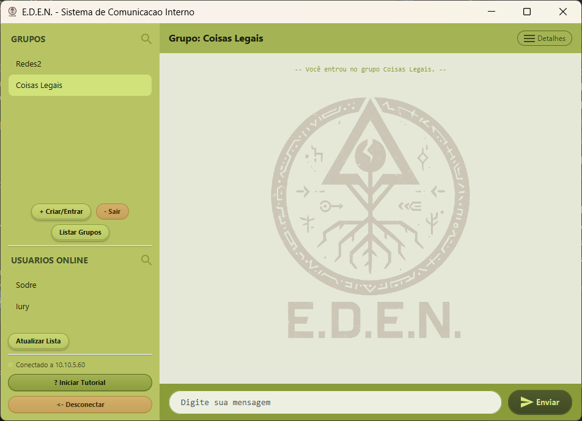
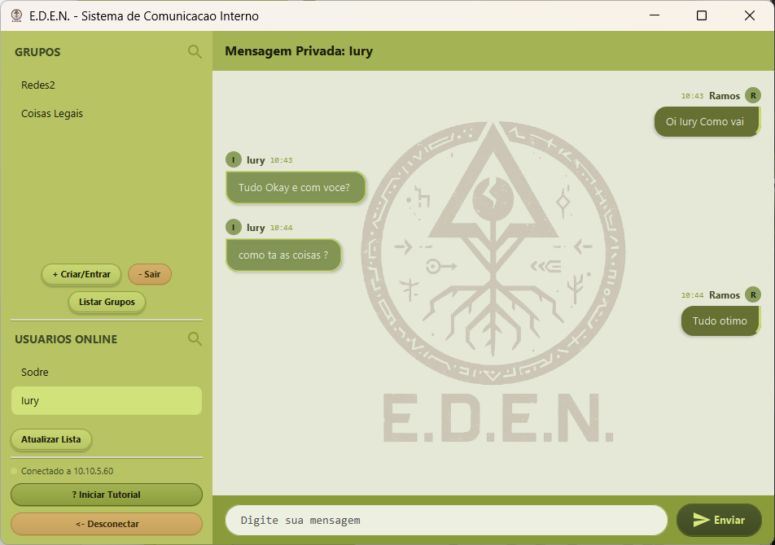
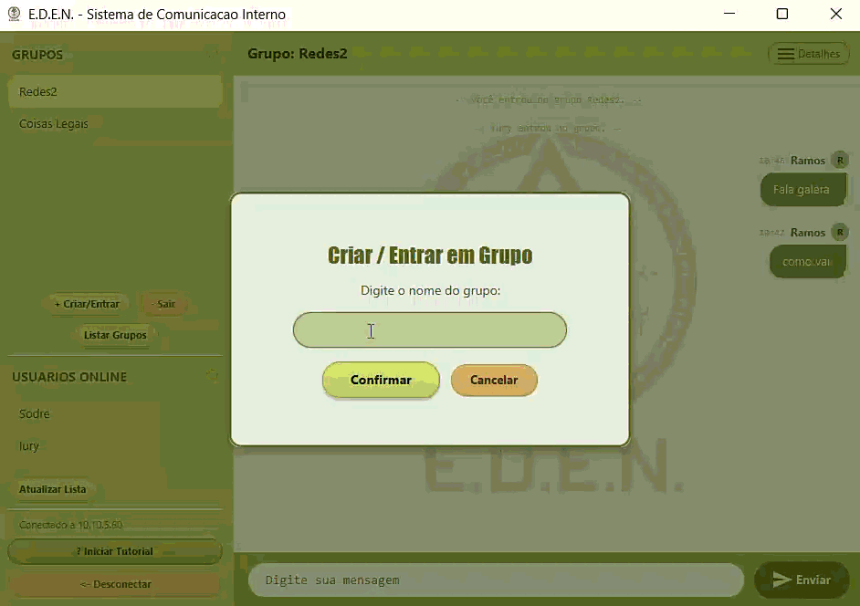
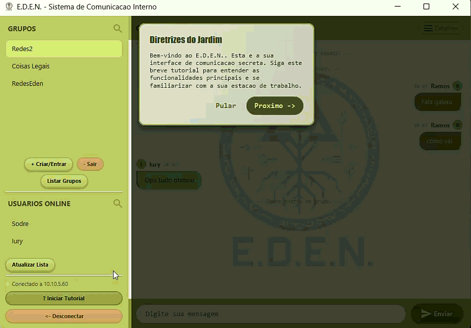

# E.D.E.N - Sistema de Comunicação Interno

*(Imagem da tela depois de entrada no sistema)*

## 📌 Sobre o Projeto
O **Sistema de Comunicação Interno da E.D.E.N** é uma aplicação cliente-servidor de mensagens instantâneas desenvolvida em Java. A aplicação permite a comunicação em tempo real entre usuários de uma rede, suportando mensagens privadas, mensagens em grupo e notificações de status dinâmicas.

O projeto implementa uma arquitetura híbrida de rede, utilizando protocolos TCP para comunicações confiáveis (como envio de mensagens e comandos) e UDP para notificações e atualizações em tempo real (como entrada/saída de usuários da rede).

**Autor:** Iury Ramos Sodre (Matrícula: 202310440)  
**Início:** 15/06/2026  
**Última alteração:** 14/09/2026  
**Disciplina:** Sistemas Distribuídos (UESB - Semestre 08)

## 🚀 Funcionalidades
- **Chat Privado e Global:** Envio de mensagens diretas para usuários específicos ou para o lobby.

  
  *(💡 Dica: Um print de uma conversa privada ou no lobby)*

- **Grupos (Salas de Bate-papo):** Criação de grupos, listagem, entrada (`JOIN`), saída (`LEAVE`) e envio de mensagens para membros de grupos específicos.

  
  *(Entrando em grupos)*

- **Lista de Usuários:** Visualização de usuários online globalmente e dos membros ativos em determinados grupos.
- **Notificações em Tempo Real:** Atualizações dinâmicas (UDP) indicando na interface quando um usuário se conecta ou desconecta.
- **Interface Gráfica (GUI):** Interface intuitiva e moderna construída com **JavaFX**, estilizada via CSS e incluindo um modo tutorial (`TutorialOverlay`).

  
  *(Tutorial)*

- **Protocolo Customizado de Aplicação:** Sistema próprio de empacotamento de dados e comandos padronizados (`JOIN`, `SENDPVT`, `LISTUSERS`, etc.) via formato `APDU`.

## 🛠️ Tecnologias e Arquitetura
- **Linguagem:** Java
- **Interface Gráfica:** JavaFX
- **Protocolos de Rede:**
  - **TCP:** Utilizado para registro, autenticação, troca de mensagens em texto (privadas e grupos) e sincronização segura de listas (usuários/grupos). O Servidor escuta na porta padrão `5000`.
  - **UDP:** Utilizado para *discovery* rápido e *broadcasting* de eventos de rede sem necessidade de estabelecer uma conexão confiável prolongada, economizando recursos.
- **Padrão Arquitetural:**
  - Atendimento Multithread (Múltiplos clientes simultâneos via instâncias de `AtendimentoCliente`).

## ⚙️ Como Executar

Por ser um projeto que utiliza JavaFX e não possuir um gerenciador de dependências (como Maven/Gradle) pré-configurado, recomenda-se a execução através de uma IDE (Eclipse, IntelliJ ou VSCode).

### 1. Inicializando o Servidor
1. Abra a pasta `Servidor` na sua IDE.
2. Execute a classe principal: `Servidor/Principal.java`.
3. O console indicará que o servidor foi iniciado e está escutando na porta configurada (TCP/UDP 5000).

### 2. Inicializando o Cliente
1. Abra a pasta `Cliente` em uma nova janela da sua IDE.
2. Certifique-se de configurar o **SDK do JavaFX** no *Build Path* do projeto (adicionando os `.jar` em *Modulepath* e incluindo os VM arguments, caso necessário).
3. Execute a classe principal: `Cliente/Principal.java`.
4. A janela da aplicação será exibida. Digite seu nome e conecte-se ao servidor (que pode ser `localhost` se executado na mesma máquina).
5. Inicie múltiplos clientes para testar e validar o envio de mensagens e atualizações de rede.

## 📖 Estrutura de Pacotes

### 🖥️ Módulo Cliente (`/Cliente`)
- `model/`: Lógica principal de comunicação com a rede (`Cliente`, `ClienteTCP`, `ClienteUDP`, `MessageListener`).
- `view/`: Telas e componentes visuais (`ClienteGUI.java`, `TutorialOverlay.java`, `style.css`, ícones).
- `utils/`: Definições do protocolo (`Protocolo.java`) e estrutura de pacotes `APDU`.
- `exceptions/`: Tratamento de exceções específicas do sistema (ex: `EDENSysException`).

### 🖧 Módulo Servidor (`/Servidor`)
- `model/`: Componentes core de roteamento e *bind* do servidor (`Servidor`, `ServidorTCP`, `ServidorUDP`, `ServidorDiscovery`).
- `controller/`: Classes de gestão de fluxo (`AtendimentoCliente` para gerir as requisições de cada conexão e `GerenciadorGrupos` para controlar as salas e membros).
- `utils/`: Utilitários e constantes espelhadas do protocolo.
- `exceptions/`: Tratamento de erros de conexão e *sockets*.

---
 Desenvolvido para a disciplina de Sistemas Distribuídos.

  

# E.D.E.N - Internal Communication System (English Version)

## 📌 About the Project
The **E.D.E.N Internal Communication System** is a client-server instant messaging application developed in Java. The application allows real-time communication between users on a network, supporting private messages, group messages, and dynamic status notifications.

The project implements a hybrid network architecture, using TCP protocols for reliable communications (such as sending messages and commands) and UDP for real-time notifications and updates (such as users joining/leaving the network).

**Author:** Iury Ramos Sodre (ID: 202310440)  
**Start Date:** 06/15/2026  
**Last Update:** 09/14/2026  
**Course:** Distributed Systems (UESB - 8th Semester)

## 🚀 Features
- **Private and Global Chat:** Send direct messages to specific users or to the lobby.

  

- **Groups (Chat Rooms):** Group creation, listing, joining (`JOIN`), leaving (`LEAVE`), and sending messages to specific group members.

  

- **User List:** View online users globally and active members in specific groups.
- **Real-Time Notifications:** Dynamic updates (UDP) indicating on the interface when a user connects or disconnects.
- **Graphical User Interface (GUI):** Intuitive and modern interface built with **JavaFX**, styled via CSS and including a tutorial mode (`TutorialOverlay`).

  

- **Custom Application Protocol:** Proprietary system for data packaging and standardized commands (`JOIN`, `SENDPVT`, `LISTUSERS`, etc.) via the `APDU` format.

## 🛠️ Technologies and Architecture
- **Language:** Java
- **GUI:** JavaFX
- **Network Protocols:**
  - **TCP:** Used for registration, authentication, text message exchange (private and groups), and secure synchronization of lists (users/groups). The Server listens on the default port `5000`.
  - **UDP:** Used for fast *discovery* and *broadcasting* of network events without the need to establish a long-term reliable connection, saving resources.
- **Architectural Pattern:**
  - Multithreaded Handling (Multiple simultaneous clients via `AtendimentoCliente` instances).

## ⚙️ How to Run

Because it is a project that uses JavaFX and does not have a pre-configured dependency manager (like Maven/Gradle), it is recommended to run it through an IDE (Eclipse, IntelliJ, or VSCode).

### 1. Starting the Server
1. Open the `Servidor` folder in your IDE.
2. Run the main class: `Servidor/Principal.java`.
3. The console will indicate that the server has started and is listening on the configured port (TCP/UDP 5000).

### 2. Starting the Client
1. Open the `Cliente` folder in a new window of your IDE.
2. Make sure to configure the **JavaFX SDK** in the project's *Build Path* (adding the `.jar` files to the *Modulepath* and including the VM arguments, if necessary).
3. Run the main class: `Cliente/Principal.java`.
4. The application window will be displayed. Enter your name and connect to the server (which can be `localhost` if running on the same machine).
5. Start multiple clients to test and validate message sending and network updates.

## 📖 Package Structure

### 🖥️ Client Module (`/Cliente`)
- `model/`: Main network communication logic (`Cliente`, `ClienteTCP`, `ClienteUDP`, `MessageListener`).
- `view/`: Screens and visual components (`ClienteGUI.java`, `TutorialOverlay.java`, `style.css`, icons).
- `utils/`: Protocol definitions (`Protocolo.java`) and `APDU` package structure.
- `exceptions/`: Handling of system-specific exceptions (e.g., `EDENSysException`).

### 🖧 Server Module (`/Servidor`)
- `model/`: Core components for routing and server *bind* (`Servidor`, `ServidorTCP`, `ServidorUDP`, `ServidorDiscovery`).
- `controller/`: Flow management classes (`AtendimentoCliente` to manage requests from each connection and `GerenciadorGrupos` to control rooms and members).
- `utils/`: Utilities and mirrored protocol constants.
- `exceptions/`: Connection and *socket* error handling.

---
 Developed for the Computer Networks 2 course.
